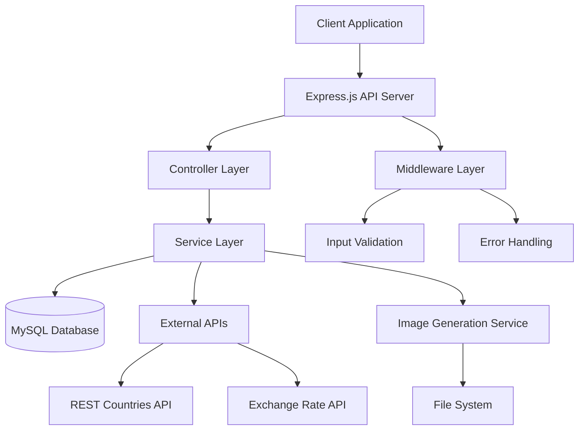
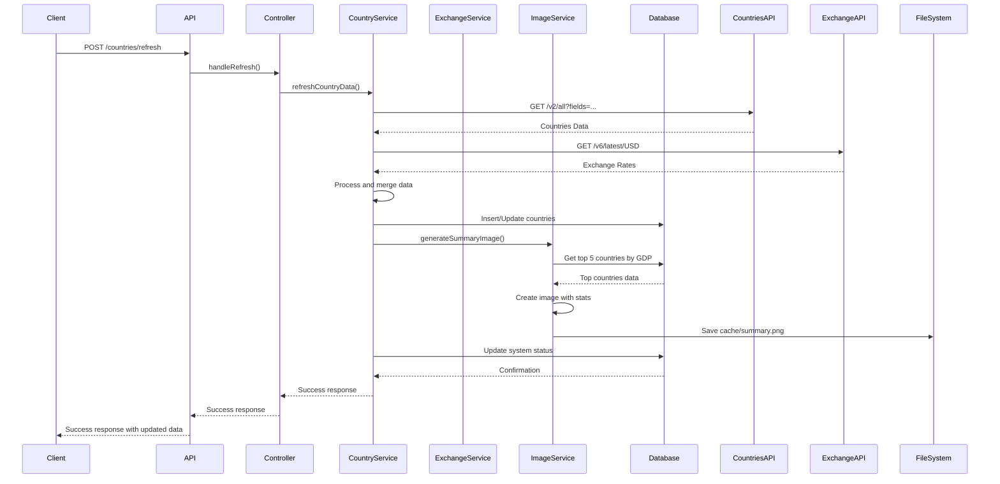
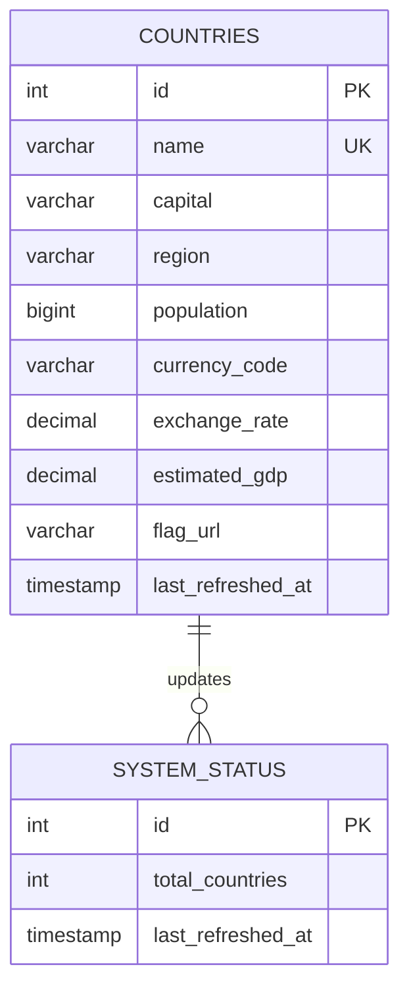
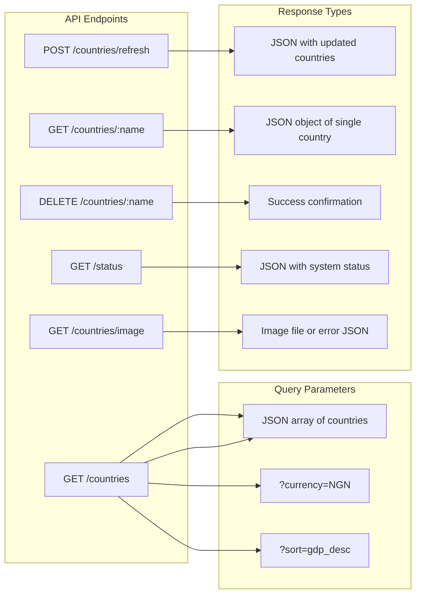
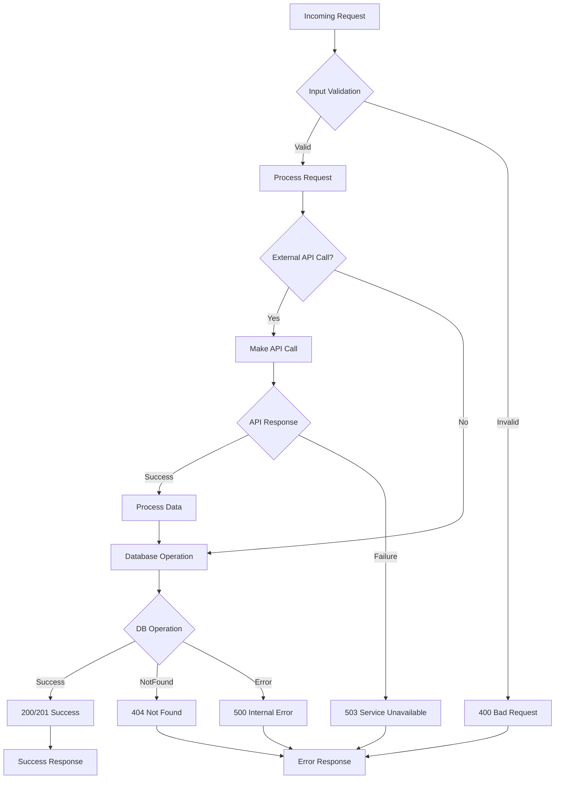

# System Architecture Diagram

## High-Level Architecture



## Data Flow for Refresh Operation



## Database Schema



## API Endpoint Structure



## Error Handling Flow



## Component Interaction

```mermaid
graph TB
    subgraph "Presentation Layer"
        Routes[Route Handlers]
        Middleware[Express Middleware]
    end
    
    subgraph "Business Logic Layer"
        CountryController[Country Controller]
        StatusController[Status Controller]
    end
    
    subgraph "Service Layer"
        CountryService[Country Service]
        ExchangeService[Exchange Rate Service]
        ImageService[Image Generation Service]
    end
    
    subgraph "Data Access Layer"
        CountryModel[Country Model]
        DatabaseConnection[DB Connection Pool]
    end
    
    subgraph "External Services"
        CountriesAPI[REST Countries API]
        ExchangeAPI[Exchange Rate API]
    end
    
    subgraph "Infrastructure"
        MySQL[(MySQL Database)]
        FileSystem[File System]
    end
    
    Routes --> CountryController
    Routes --> StatusController
    Middleware --> Routes
    
    CountryController --> CountryService
    StatusController --> CountryService
    
    CountryService --> CountryModel
    CountryService --> ExchangeService
    CountryService --> ImageService
    
    ExchangeService --> CountriesAPI
    ExchangeService --> ExchangeAPI
    
    CountryModel --> DatabaseConnection
    DatabaseConnection --> MySQL
    
    ImageService --> FileSystem